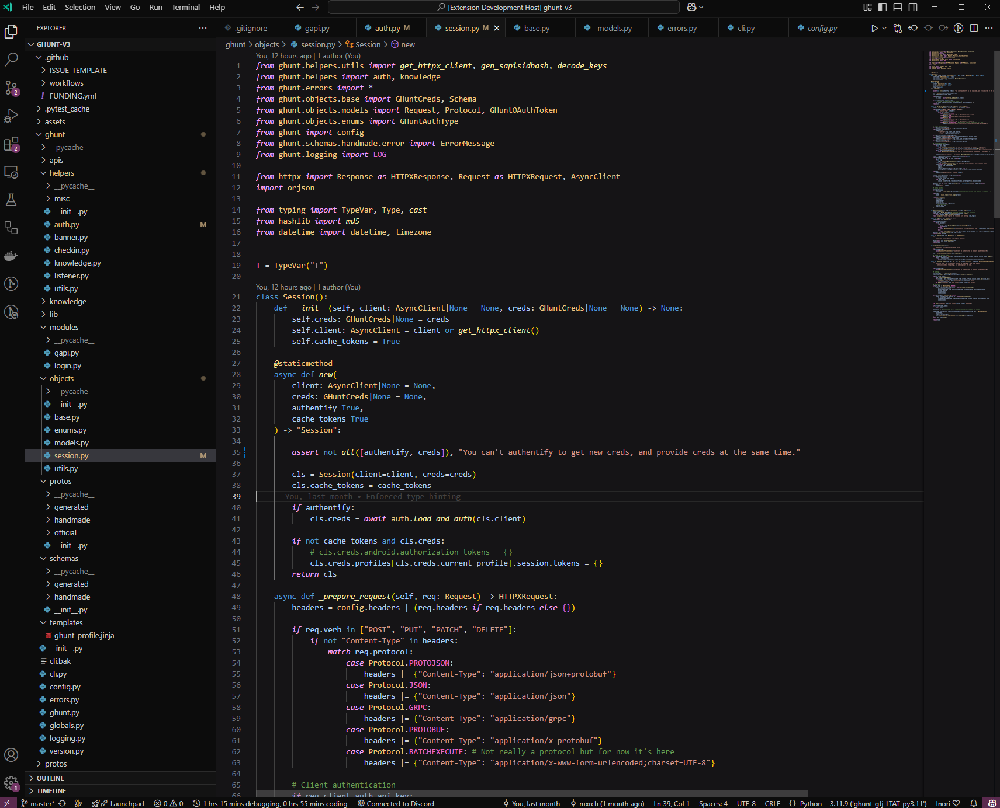

# Obscure

A modern & dark theme, that respects type hint, inspired by Modern Dark and Cursor.\
*Darker UI, vibes of purple, orange and blue and less borders.*

## Why ?

A lot of custom themes is wrong at type hint, and will show you the same colors for typed and non-typed variables, making you losing time at coding.\
So I made a theme that I like, based on the default Modern Dark, that already respects the type hint.

